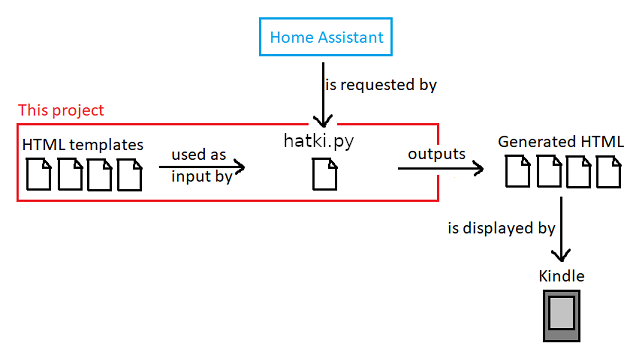

# Hatki
```
 __              __    __     __                                        
|  |__  _____  _/  |_ |  | __|__|                                       
|  |  \ \__  \ \   __\|  |/ /|  |  hatki - Home Assistant To Kindle/HTML
|   |  \ / __ \_|  |  |    \ |  |  v2 (2021-03-13) by Knoe-WG           
|___|__/(______/|__|  |__|__\|__|                                       


```
## What this project does

This Project is intendet to gives old Devices such as a Amazon Kindle a new life by enabeling them to represent Homeassistant enteties. 

This project contains template HTML files. These files are read by the python
script. The python script requests data from Home Assistant and uses that data
to fill in the placeholders in the template HTML files. The resulting HTML files
can be opened by the Kindle web browser.



## How to run `hatki.py`

```
usage: hatki.py [-h] -u URL [-t TOKENFILE] [-i INPUTFOLDER] [-o OUTPUTFOLDER]

optional arguments:
  -h, --help            show this help message and exit
  -u URL, --url URL     Home Assistant API URL, e.g.
                        https://localhost:8123/api
  -t TOKENFILE, --tokenfile TOKENFILE
                        File that contains the Token for the Home Assistant
                        API. (default value: token.txt)
  -i INPUTFOLDER, --inputfolder INPUTFOLDER
                        Path to the folder that contains the HTML templates.
                        NOTE: Subfolders are NOT supported. (default value:
                        html-templates)
  -o OUTPUTFOLDER, --outputfolder OUTPUTFOLDER
                        Path to the folder where the generated HTML files will
                        be written. (default value: generated-html)
```
## Files

| File / Folder | Description |
| ----------- | ----------- |
| css | Contais common CSS styles that are used by several pages. CSS that is specific to one html file, is contained in that specific file. |
| generated-html | This folder will contain the generated html files. There is no need to push these files to git. |
| html-templates | Contains the template html files, that contain the placeholders. |
| images | Contains all images that are used in the html files. |
| hatki.py | Pyhton programm that reads the template html files, requests data from Home Assistant, and generates the html pages |

Requirements

* API Token for your Homeassistans Instance
* Requires python3 and the python library "requests"
* Host to run the hatki.py script and host the generated-html files.
* Device to show the Website (in this case a jailbroken Kindle Touch)

## How to add a sensor/switch to render:
Example for a placeholder:

```
{{media_player.spotify_user1:attributes.media_artist}}
{{sensor.doorbell_triggered:attributes.timestamp}}
{{sensor.esp_temperature:state}}

```

Link to Homeassistant Community post: 
https://community.home-assistant.io/t/hatki-homeassistant-to-kindle-kiosk-dashboard/552843
